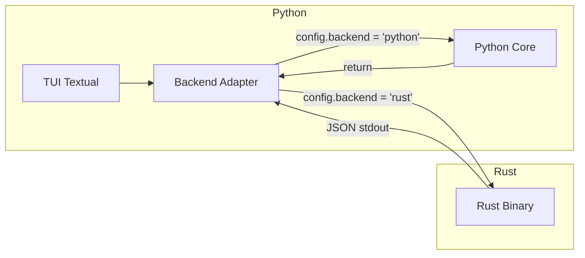

Excelente pregunta. Hay varias formas de lograr esto. Te las presento ordenadas de más simple a más compleja:

---

# Opciones para Backend Agnóstico

## Opción 1: Protocol/Interface + Subprocess (Recomendada)



**Idea**: Rust compila a un binario CLI que recibe input (JSON/stdin) y devuelve output (JSON/stdout). Python lo invoca como subprocess.

```python
# core/backend.py
from abc import ABC, abstractmethod
from typing import Protocol
import subprocess
import json

class BackendProtocol(Protocol):
    """Contrato que ambos backends deben cumplir"""
    def solve(self, tpm: list, estado: list, strategy: str) -> dict: ...
    def condicionar(self, system_data: dict, indices: list) -> dict: ...
    def marginalizar(self, system_data: dict, ejes: list) -> dict: ...


class PythonBackend:
    """Backend nativo Python"""
    def solve(self, tpm, estado, strategy):
        from .system import System
        from .strategies import StrategyRegistry
        
        sys = System.from_tpm(tpm, estado)
        strat = StrategyRegistry.get(strategy)()
        result = strat.solve(sys)
        return result.to_dict()


class RustBackend:
    """Backend que delega a binario Rust"""
    def __init__(self, binary_path: str = "mip-rust"):
        self.binary = binary_path
    
    def _call(self, command: str, data: dict) -> dict:
        payload = json.dumps({"command": command, **data})
        result = subprocess.run(
            [self.binary],
            input=payload,
            capture_output=True,
            text=True,
            check=True
        )
        return json.loads(result.stdout)
    
    def solve(self, tpm, estado, strategy):
        return self._call("solve", {
            "tpm": tpm,
            "estado_inicial": estado,
            "strategy": strategy
        })


# Selector basado en config
def get_backend() -> BackendProtocol:
    from .config import config
    
    if config.backend == "rust":
        return RustBackend(config.rust_binary_path)
    return PythonBackend()
```

**Rust side** (main.rs simplificado):
```rust
use serde::{Deserialize, Serialize};
use std::io::{self, Read};

#[derive(Deserialize)]
struct Request {
    command: String,
    tpm: Option<Vec<Vec<f32>>>,
    estado_inicial: Option<Vec<u8>>,
    strategy: Option<String>,
    // ... otros campos según comando
}

#[derive(Serialize)]
struct Response {
    success: bool,
    data: serde_json::Value,
    error: Option<String>,
}

fn main() {
    let mut input = String::new();
    io::stdin().read_to_string(&mut input).unwrap();
    
    let req: Request = serde_json::from_str(&input).unwrap();
    
    let response = match req.command.as_str() {
        "solve" => handle_solve(req),
        "condicionar" => handle_condicionar(req),
        _ => Response { success: false, data: serde_json::Value::Null, error: Some("Unknown command".into()) }
    };
    
    println!("{}", serde_json::to_string(&response).unwrap());
}
```

**Pros**: 
- Simple
- Sin dependencias de compilación complejas
- Rust y Python completamente desacoplados
- Debug fácil (puedes probar el binario Rust por separado)

**Cons**: 
- Overhead de serialización JSON
- Overhead de spawn proceso (mitigable con proceso persistente)

---

## Opción 2: PyO3 (Bindings nativos)

Rust compila a una librería Python nativa (.so/.pyd):

```rust
// lib.rs con PyO3
use pyo3::prelude::*;

#[pyclass]
struct NCube {
    indice: u8,
    dims: Vec<u8>,
    data: Vec<f32>,
}

#[pymethods]
impl NCube {
    #[new]
    fn new(indice: u8, dims: Vec<u8>, data: Vec<f32>) -> Self {
        Self { indice, dims, data }
    }
    
    fn marginalizar(&self, ejes: Vec<u8>) -> NCube {
        // implementación Rust
    }
}

#[pymodule]
fn mip_rust(_py: Python, m: &PyModule) -> PyResult<()> {
    m.add_class::<NCube>()?;
    Ok(())
}
```

```python
# En Python, se usa igual que código nativo
try:
    from mip_rust import NCube as RustNCube
    USE_RUST = True
except ImportError:
    USE_RUST = False
    from .ncube import NCube as RustNCube  # fallback Python
```

**Pros**: 
- Máximo rendimiento (sin serialización)
- API idéntica en Python

**Cons**: 
- Compilación más compleja (maturin, setuptools-rust)
- Binding para cada plataforma

---

## Opción 3: Proceso Persistente (Daemon)

Similar a Opción 1 pero el proceso Rust se mantiene vivo:

```python
class RustDaemon:
    def __init__(self):
        self.process = subprocess.Popen(
            ["mip-rust", "--daemon"],
            stdin=subprocess.PIPE,
            stdout=subprocess.PIPE,
            text=True
        )
    
    def call(self, command: str, data: dict) -> dict:
        payload = json.dumps({"command": command, **data}) + "\n"
        self.process.stdin.write(payload)
        self.process.stdin.flush()
        response = self.process.stdout.readline()
        return json.loads(response)
    
    def close(self):
        self.process.terminate()
```

---

# Recomendación

Para tu caso: **Opción 1 (Subprocess + JSON)** porque:

1. **Desarrollo independiente** - Puedes avanzar en Python mientras Rust está en progreso
2. **Testing separado** - Cada backend se prueba por su cuenta
3. **Sin compilación cruzada** - No necesitas PyO3/maturin
4. **Fácil de debuggear** - `echo '{"command":"solve",...}' | ./mip-rust`

---

# Arquitectura Actualizada

```
mip/
├── src/mip/
│   ├── core/
│   │   ├── backend.py      # BackendProtocol + PythonBackend + RustBackend
│   │   ├── ncube.py        # Implementación Python
│   │   └── system.py
│   │
│   ├── config/
│   │   └── app.py          # config.backend = "python" | "rust"
│   │
│   └── tui/
│       └── ...             # Usa get_backend(), agnóstico
│
├── rust/                    # Proyecto Rust separado
│   ├── Cargo.toml
│   └── src/
│       ├── main.rs         # CLI JSON interface
│       ├── ncube.rs
│       └── system.rs
│
└── bin/
    └── mip-rust            # Binario compilado (gitignore, descargable o compilable)
```

---

# Ejemplo de Uso en TUI

```python
# tui/screens/testing.py
from mip.core.backend import get_backend

class TestingScreen(Screen):
    def on_mount(self):
        self.backend = get_backend()  # Automáticamente Python o Rust según config
    
    async def run_test(self, case: TestCase):
        # La TUI no sabe si es Python o Rust
        result = await asyncio.to_thread(
            self.backend.solve,
            case.tpm,
            case.estado,
            case.strategy
        )
        self.show_result(result)
```

---

# Contrato JSON (Schema)

```json
// Request solve
{
  "command": "solve",
  "tpm": [[0.0, 0.5], [1.0, 0.5], ...],
  "estado_inicial": [1, 0, 0],
  "strategy": "brute_force"
}

// Response
{
  "success": true,
  "data": {
    "phi": 0.125,
    "partition": {
      "alcance": [0, 1],
      "mecanismo": [2]
    },
    "time_ms": 42
  }
}
```

---

¿Te parece bien este approach? Así puedes:
1. Desarrollar TUI + Python Core ahora
2. Implementar Rust Core cuando quieras
3. Cambiar con una sola config: `backend = "rust"`