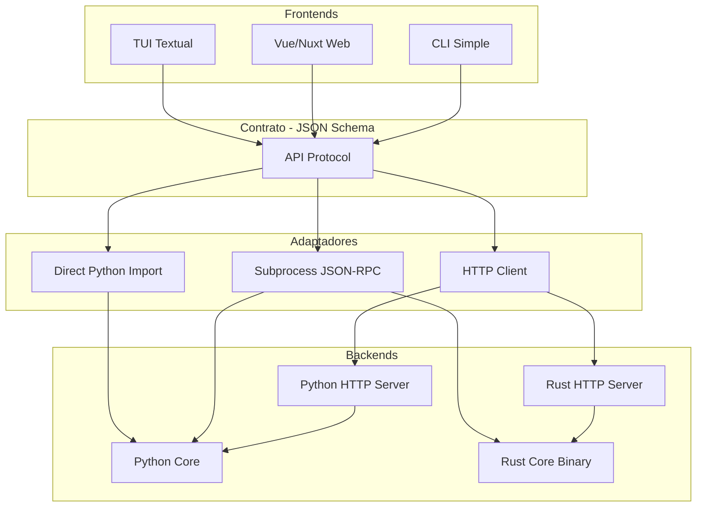
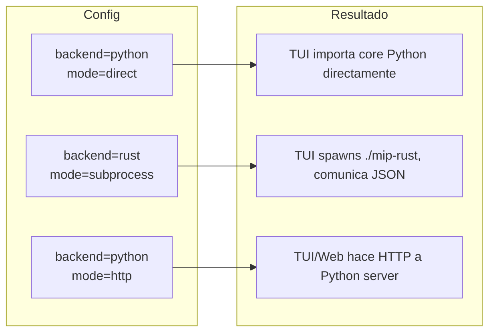

Excelente pregunta. Este es un problema de **arquitectura de sistemas desacoplados**. Analicemos las opciones.

---

# Análisis del Problema

## Requisitos
1. **Backend intercambiable**: Python ↔ Rust
2. **Frontend intercambiable**: TUI Python ↔ Web (Vue/Nuxt)
3. **Sin reescribir lógica de presentación** al cambiar backend
4. **Sin reescribir lógica de negocio** al cambiar frontend

## Opciones de Comunicación

| Método | Pros | Contras | Complejidad |
|--------|------|---------|-------------|
| **FFI (PyO3)** | Mínimo overhead, llamadas directas | Solo Python↔Rust, compilación compleja | Alta |
| **HTTP REST** | Universal, cualquier cliente | Requiere servidor, overhead HTTP | Media |
| **CLI/Subprocess** | Simple, backend es ejecutable | Overhead de spawn, parsing | Baja |
| **JSON-RPC via stdio** | Estándar, bidireccional, sin servidor | Menos conocido | Media |
| **gRPC** | Tipado fuerte, eficiente | Requiere protobuf, más setup | Alta |
| **WebSocket** | Tiempo real, bidireccional | Más complejo para request/response | Media |

---

# Solución Recomendada: Arquitectura de Puertos y Adaptadores



---

# El Contrato (Lo más importante)

Define **exactamente** qué puede pedir el frontend y qué responde el backend.

```python
# protocol/schema.py
from dataclasses import dataclass
from typing import Literal

# ============ REQUESTS ============

@dataclass(frozen=True)
class CreateSystemRequest:
    type: Literal["create_system"] = "create_system"
    tpm: list[list[float]]
    estado_inicial: list[int]

@dataclass(frozen=True)
class CondicionarRequest:
    type: Literal["condicionar"] = "condicionar"
    system_id: str
    indices: list[int]

@dataclass(frozen=True)
class SubstraerRequest:
    type: Literal["substraer"] = "substraer"
    system_id: str
    alcance: list[int]
    mecanismo: list[int]

@dataclass(frozen=True)
class SolveRequest:
    type: Literal["solve"] = "solve"
    system_id: str
    strategy: str

# ============ RESPONSES ============

@dataclass(frozen=True)
class SystemResponse:
    system_id: str
    indices: list[int]
    dims: list[int]
    ncubos: list[dict]  # cada ncubo serializado

@dataclass(frozen=True)
class SolutionResponse:
    phi: float
    partition: dict
    time_ms: float

@dataclass(frozen=True)
class ErrorResponse:
    error: str
    code: int
```

**JSON equivalente:**
```json
// Request
{"type": "create_system", "tpm": [[0,0,0],[0,0,1],...], "estado_inicial": [1,0,0]}

// Response
{"system_id": "abc123", "indices": [0,1,2], "dims": [0,1,2], "ncubos": [...]}
```

---

# Capa de Abstracción: Backend Adapter

```python
# adapters/base.py
from abc import ABC, abstractmethod
from protocol.schema import *

class BackendAdapter(ABC):
    """Interfaz que todos los adaptadores deben implementar."""
    
    @abstractmethod
    def create_system(self, tpm: list[list[float]], estado: list[int]) -> SystemResponse:
        ...
    
    @abstractmethod
    def condicionar(self, system_id: str, indices: list[int]) -> SystemResponse:
        ...
    
    @abstractmethod
    def substraer(self, system_id: str, alcance: list[int], mecanismo: list[int]) -> SystemResponse:
        ...
    
    @abstractmethod
    def solve(self, system_id: str, strategy: str) -> SolutionResponse:
        ...
    
    @abstractmethod
    def close(self):
        ...
```

---

# Adaptador 1: Python Directo (desarrollo/testing)

```python
# adapters/direct_python.py
from .base import BackendAdapter
from core.system import System
from core.ncube import NCube
import numpy as np
import uuid

class DirectPythonAdapter(BackendAdapter):
    """Usa el core Python directamente. Sin serialización."""
    
    def __init__(self):
        self._systems: dict[str, System] = {}
    
    def create_system(self, tpm, estado):
        system = System.from_tpm(np.array(tpm), tuple(estado))
        sid = str(uuid.uuid4())[:8]
        self._systems[sid] = system
        return self._to_response(sid, system)
    
    def condicionar(self, system_id, indices):
        system = self._systems[system_id]
        new_system = system.condicionar(tuple(indices))
        new_id = str(uuid.uuid4())[:8]
        self._systems[new_id] = new_system
        return self._to_response(new_id, new_system)
    
    # ... resto de métodos
    
    def _to_response(self, sid, system):
        return SystemResponse(
            system_id=sid,
            indices=list(system.indices),
            dims=list(system.dims),
            ncubos=[self._ncube_to_dict(c) for c in system.ncubos]
        )
    
    def close(self):
        self._systems.clear()
```

---

# Adaptador 2: Subprocess (Rust o Python CLI)

```python
# adapters/subprocess_adapter.py
import subprocess
import json
from .base import BackendAdapter

class SubprocessAdapter(BackendAdapter):
    """Comunica con un backend via stdin/stdout JSON-RPC."""
    
    def __init__(self, executable: str):
        # executable puede ser "python -m mip.backend" o "./mip-rust"
        self._proc = subprocess.Popen(
            executable.split(),
            stdin=subprocess.PIPE,
            stdout=subprocess.PIPE,
            text=True
        )
    
    def _call(self, request: dict) -> dict:
        # Enviar request
        self._proc.stdin.write(json.dumps(request) + "\n")
        self._proc.stdin.flush()
        # Leer response
        line = self._proc.stdout.readline()
        return json.loads(line)
    
    def create_system(self, tpm, estado):
        resp = self._call({
            "type": "create_system",
            "tpm": tpm,
            "estado_inicial": estado
        })
        return SystemResponse(**resp)
    
    def condicionar(self, system_id, indices):
        resp = self._call({
            "type": "condicionar",
            "system_id": system_id,
            "indices": indices
        })
        return SystemResponse(**resp)
    
    # ... resto
    
    def close(self):
        self._proc.stdin.close()
        self._proc.wait()
```

---

# Adaptador 3: HTTP (para Web frontend)

```python
# adapters/http_adapter.py
import httpx  # o requests
from .base import BackendAdapter

class HTTPAdapter(BackendAdapter):
    """Comunica con backend via HTTP REST."""
    
    def __init__(self, base_url: str = "http://localhost:8080"):
        self._client = httpx.Client(base_url=base_url)
    
    def create_system(self, tpm, estado):
        resp = self._client.post("/system", json={
            "tpm": tpm,
            "estado_inicial": estado
        })
        return SystemResponse(**resp.json())
    
    def condicionar(self, system_id, indices):
        resp = self._client.post(f"/system/{system_id}/condicionar", json={
            "indices": indices
        })
        return SystemResponse(**resp.json())
    
    # ... resto
    
    def close(self):
        self._client.close()
```

---

# Factory para elegir adaptador

```python
# adapters/__init__.py
from .base import BackendAdapter
from .direct_python import DirectPythonAdapter
from .subprocess_adapter import SubprocessAdapter
from .http_adapter import HTTPAdapter

def get_adapter(backend: str = "python", mode: str = "direct") -> BackendAdapter:
    """
    Factory para obtener el adaptador correcto.
    
    backend: "python" | "rust"
    mode: "direct" | "subprocess" | "http"
    """
    if mode == "direct" and backend == "python":
        return DirectPythonAdapter()
    
    if mode == "subprocess":
        if backend == "python":
            return SubprocessAdapter("python -m mip.backend")
        else:  # rust
            return SubprocessAdapter("./target/release/mip-rust")
    
    if mode == "http":
        # Asume que el servidor ya está corriendo
        return HTTPAdapter("http://localhost:8080")
    
    raise ValueError(f"Combinación no soportada: {backend}/{mode}")
```

---

# Backend Rust (JSON-RPC via stdio)

```rust
// main.rs del backend Rust
use std::io::{self, BufRead, Write};
use serde::{Deserialize, Serialize};
use serde_json;

#[derive(Deserialize)]
#[serde(tag = "type")]
enum Request {
    #[serde(rename = "create_system")]
    CreateSystem { tpm: Vec<Vec<f64>>, estado_inicial: Vec<u8> },
    
    #[serde(rename = "condicionar")]
    Condicionar { system_id: String, indices: Vec<u8> },
    
    // ... otros
}

#[derive(Serialize)]
struct SystemResponse {
    system_id: String,
    indices: Vec<u8>,
    dims: Vec<u8>,
    ncubos: Vec<NCubeJson>,
}

fn main() {
    let stdin = io::stdin();
    let mut stdout = io::stdout();
    
    // Estado: sistemas en memoria
    let mut systems: std::collections::HashMap<String, System> = HashMap::new();
    
    for line in stdin.lock().lines() {
        let line = line.unwrap();
        let request: Request = serde_json::from_str(&line).unwrap();
        
        let response = match request {
            Request::CreateSystem { tpm, estado_inicial } => {
                let system = System::from_tpm(&tpm, &estado_inicial);
                let id = uuid::Uuid::new_v4().to_string()[..8].to_string();
                systems.insert(id.clone(), system);
                // serializar response
            },
            Request::Condicionar { system_id, indices } => {
                let system = systems.get(&system_id).unwrap();
                let new_system = system.condicionar(&indices);
                // ...
            },
            // ...
        };
        
        writeln!(stdout, "{}", serde_json::to_string(&response).unwrap()).unwrap();
        stdout.flush().unwrap();
    }
}
```

---

# TUI Agnóstica

```python
# tui/app.py
from textual.app import App
from adapters import BackendAdapter, get_adapter
from config import Config

class MIPApp(App):
    def __init__(self):
        super().__init__()
        # Lee config para saber qué backend usar
        cfg = Config.load()
        self.backend: BackendAdapter = get_adapter(
            backend=cfg.backend,  # "python" | "rust"
            mode=cfg.mode         # "direct" | "subprocess" | "http"
        )
    
    def on_mount(self):
        # La TUI NO sabe si habla con Python o Rust
        # Solo usa self.backend.create_system(), etc.
        pass
    
    def action_quit(self):
        self.backend.close()
        self.exit()
```

---

# Web Frontend (Vue/Nuxt)

El web frontend simplemente hace fetch al HTTP endpoint:

```typescript
// composables/useBackend.ts
export function useBackend() {
  const baseUrl = useRuntimeConfig().public.backendUrl
  
  async function createSystem(tpm: number[][], estado: number[]) {
    const resp = await $fetch(`${baseUrl}/system`, {
      method: 'POST',
      body: { tpm, estado_inicial: estado }
    })
    return resp
  }
  
  async function condicionar(systemId: string, indices: number[]) {
    return await $fetch(`${baseUrl}/system/${systemId}/condicionar`, {
      method: 'POST',
      body: { indices }
    })
  }
  
  // ...
}
```

Cambiando `backendUrl` apuntas a Python o Rust HTTP server.

---

# Estructura Final

```
mip/
├── protocol/                # 📜 CONTRATO (compartido)
│   ├── schema.py           # Dataclasses Python
│   └── schema.json         # JSON Schema (para validación)
│
├── adapters/               # 🔌 Adaptadores
│   ├── base.py
│   ├── direct_python.py
│   ├── subprocess_adapter.py
│   └── http_adapter.py
│
├── core/                   # 🧠 Core Python
│   ├── ncube.py
│   └── system.py
│
├── backend/                # 🖥️ Backend como servicio
│   ├── __main__.py        # JSON-RPC via stdio
│   └── http_server.py     # HTTP server (FastAPI/Starlette)
│
├── tui/                    # Terminal UI
│   └── ...
│
├── config/
│   └── settings.toml      # backend = "rust", mode = "subprocess"
│
└── mip-rust/              # 📦 Proyecto Rust separado
    ├── Cargo.toml
    └── src/
        ├── main.rs        # JSON-RPC via stdio
        ├── ncube.rs
        └── system.rs
```

---

# Resumen de Decisiones

| Decisión | Elección | Razón |
|----------|----------|-------|
| **Protocolo** | JSON-RPC via stdio | Simple, sin servidor, funciona local |
| **Serialización** | JSON | Universal, fácil debug |
| **Backend switch** | Config file | Cambiar `backend = "rust"` y listo |
| **Web support** | HTTP adapter | El backend expone HTTP cuando web lo necesita |
| **Contrato** | Dataclasses + JSON Schema | Tipado en ambos lados |

---

# Flujo según configuración



---

¿Quieres que profundice en alguna parte específica? Por ejemplo:
1. Implementación completa del protocolo JSON-RPC
2. El backend HTTP con FastAPI
3. Cómo compartir el JSON Schema entre Python y Rust
4. Testing de los adaptadores